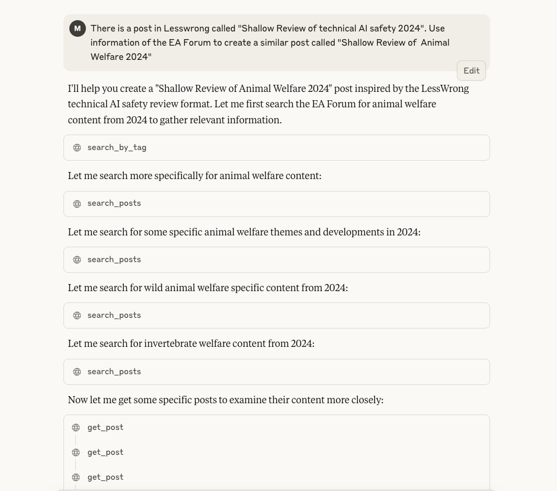

# EA Forum MCP Server

An MCP (Model Context Protocol) server that provides access to the EA Forum's content.

## Features

- **Full-text search** - Search EA Forum posts using Algolia's powerful search engine
- **Post retrieval** - Get complete post content including HTML and metadata
- **Tag-based search** - Search posts by specific EA-related tags
- **Caching** - Built-in TTL cache to reduce API calls
- **Retry logic** - Automatic retry with exponential backoff for failed requests
- **Type safety** - Full type hints for better development experience

## Installation

1. Clone the repository:
```bash
git clone https://github.com/yourusername/ea-forum-mcp-server.git
cd ea-forum-mcp-server
```

2. Create a virtual environment (recommended):
```bash
python -m venv venv
source venv/bin/activate  # On Windows: venv\Scripts\activate
```

3. Install dependencies:
```bash
pip install -r requirements.txt
```

## Configuration

1. Copy the example environment file:
```bash
cp .env.example .env
```

2. Edit `.env` if needed (default values should work fine)

## Usage Examples

### Basic Usage: AI Safety Research Summary

The EA Forum MCP Server can help you quickly gather and summarize content on specific topics. Here's an example of searching for AI Safety posts from the last month:


The server uses multiple tools to search, filter by date, and retrieve full post content to generate comprehensive summaries:


### Advanced Usage 1: Creating Content Based on EA Forum Research

You can use the server to research existing content and create new posts inspired by successful formats. This example shows creating an "Animal Welfare 2024" review based on the LessWrong AI safety review format:



The result is a well-structured post with insights gathered from multiple EA Forum sources:


### Advanced Usage 2: Hackathon Proposal Enhancement

The server can help strengthen project proposals by finding relevant research and evidence from the EA Forum. Here's an example of enhancing a mental health chatbot red teaming proposal:


The server finds relevant posts about AI safety evaluation, mental health interventions, and regulatory frameworks to create a comprehensive proposal:


## Usage

### Running the Server

```bash
python -m src.server
```

### Available Tools

#### 1. `search_posts`
Search EA Forum posts using full-text search.

**Parameters:**
- `query` (required): Search query string
- `date_range` (optional): Filter by time period ('day', 'week', 'month', 'year')
- `limit` (optional): Number of results (default: 10, max: 100)
- `page` (optional): Page number for pagination (0-based)
- `curated_only` (optional): Only return curated posts (default: false)
- `exclude_events` (optional): Exclude event posts (default: true)

**Example:**
```json
{
  "tool": "search_posts",
  "arguments": {
    "query": "AI safety research",
    "date_range": "week",
    "limit": 20
  }
}
```

#### 2. `get_post`
Get full content of a specific EA Forum post by ID.

**Parameters:**
- `post_id` (required): The post ID to retrieve

**Example:**
```json
{
  "tool": "get_post",
  "arguments": {
    "post_id": "o8zS7cLN5j3XviMFe"
  }
}
```

#### 3. `search_by_tag`
Search posts by a specific EA-related tag.

**Parameters:**
- `tag` (required): Tag name from predefined list
- `limit` (optional): Number of results (default: 30)

**Available tags:**
- `ai_safety` - AI safety
- `community` - Community
- `global_health` - Global health & development
- `biosecurity` - Biosecurity
- `career_choice` - Career choice
- `policy` - Policy
- `funding` - Funding opportunities
- `malaria` - Malaria
- `research` - Research
- `vaccines` - Vaccines

**Example:**
```json
{
  "tool": "search_by_tag",
  "arguments": {
    "tag": "ai_safety",
    "limit": 10
  }
}
```

## MCP Client Configuration

To use this server with an MCP client, add it to your client's configuration:

```json
{
  "mcpServers": {
    "ea-forum": {
      "command": "python",
      "args": ["-m", "src.server"],
      "cwd": "/path/to/ea-forum-mcp-server",
      "env": {
        "PYTHONPATH": "/path/to/ea-forum-mcp-server"
      }
    }
  }
}
```

Note: The `PYTHONPATH` environment variable is required to help Python find the `src` module.

## Development

### Testing

The project includes two test scripts for verifying functionality:

#### 1. Automated Test Suite (`tests/test_server.py`)

Runs comprehensive tests on all server components:

```bash
# From project root
python tests/test_server.py

# Or from tests directory
cd tests
python test_server.py
```

This script tests:
- Search functionality with various filters
- Post content retrieval
- Tag-based searching
- Cache operations
- Error handling

#### 2. Interactive Test Client (`tests/interactive_test.py`)

Provides a menu-driven interface for manual testing:

```bash
# From project root
python tests/interactive_test.py

# Or from tests directory
cd tests
python interactive_test.py
```

Features:
- Interactive menu for testing each tool
- Custom query inputs
- Real-time results display
- Useful for exploring API capabilities before MCP integration


## Architecture

The server is structured as follows:

- `src/server.py` - Main MCP server implementation
- `src/clients/` - API client implementations
  - `algolia_client.py` - Algolia search API client
  - `graphql_client.py` - GraphQL API client for post content
- `src/models/` - Type definitions
  - `types.py` - TypedDict definitions for API responses
- `src/utils/` - Utility modules
  - `cache.py` - TTL cache implementation
  - `retry.py` - Retry decorator with exponential backoff
- `src/config/` - Configuration management
  - `settings.py` - Environment-based settings


## Contributing

1. Fork the repository
2. Create a feature branch (`git checkout -b feature/amazing-feature`)
3. Commit your changes (`git commit -m 'Add amazing feature'`)
4. Push to the branch (`git push origin feature/amazing-feature`)
5. Open a Pull Request

## License

This project is licensed under the MIT License - see the LICENSE file for details.

## Acknowledgments

- EA Forum
- Max from the [Even More Effective Team](https://even-more-effective.github.io) ❤️

